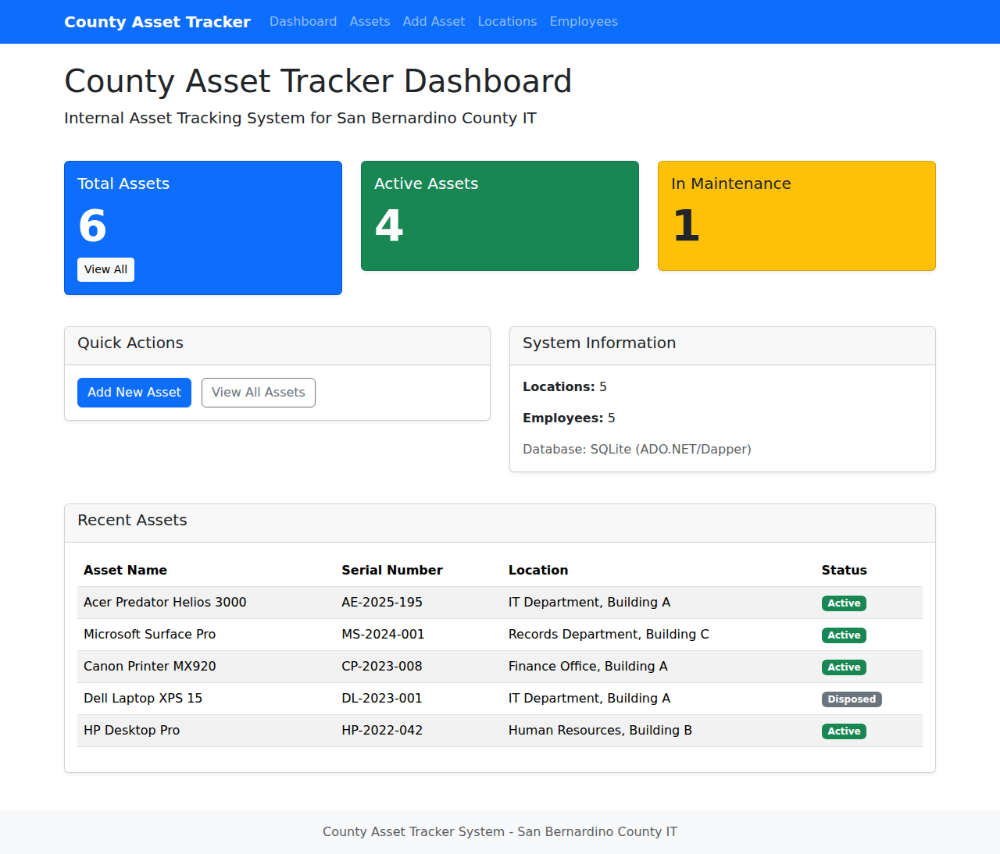
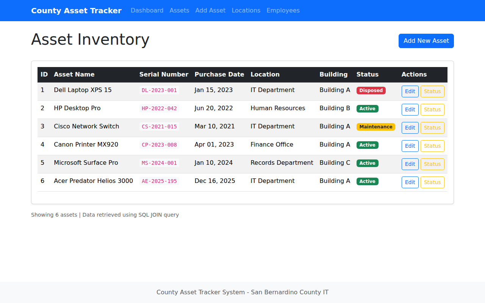

<div align="center">

# County Asset Tracker

**A web-based Internal Asset Tracking System for San Bernardino County IT**


</div>

---

## Overview

County governments manage thousands of IT assets across multiple buildings and departments. Without a centralized system, tracking hardware assignments, maintenance status, and custodian accountability becomes error-prone and time-consuming.

**County Asset Tracker** solves this by providing a clean, web-based interface for managing IT assets, locations, and employee assignments. It demonstrates proficiency in **C#/.NET** and **SQL/Database Management** -- the core technologies used by San Bernardino County IT.

### Core Features

- **Dashboard** with real-time asset statistics and recent asset overview
- **Full CRUD operations** for asset management (Create, Read, Update, Delete)
- **Relational database** with three normalized tables and proper foreign key constraints
- **Parameterized SQL queries** preventing SQL injection attacks
- **JOIN queries** combining data across Assets, Locations, and Employees
- **Object-relational mapping** using Dapper for clean C# data access
- **Responsive UI** built with Bootstrap 5 and Razor Pages

### Dashboard


### Asset Inventory


---

## Table of Contents

- [Overview](#overview)
- [Prerequisites](#prerequisites)
- [Installation](#installation)
- [Usage / Quick Start](#usage--quick-start)
- [Architecture / How It Works](#architecture--how-it-works)
- [Database Design](#database-design)
- [C# Code Highlights](#c-code-highlights)
- [Configuration / Environment Variables](#configuration--environment-variables)
- [Testing](#testing)
- [Contributing](#contributing)
- [License](#license)
- [Contact / Support](#contact--support)

---

## Prerequisites

Before running the project, ensure you have the following installed:

- **.NET SDK 8.0** or later ([Download](https://dotnet.microsoft.com/download/dotnet/8.0))
- **Git** for cloning the repository
- A modern web browser (Chrome, Firefox, Edge)
- No external database server required -- SQLite is embedded

### Database -- No Setup Required

This project uses **SQLite**, an embedded database that requires **zero installation or configuration**. When you run the application for the first time, it automatically:

1. Creates the `CountyAssets.db` file in the project directory
2. Executes the SQL schema (`Database/schema.sql`) to create all three tables
3. Seeds the database with sample locations, assets, and employee records

There is no database server to install, no connection strings to edit, and no migrations to run. Everything is handled by the `DatabaseManager.InitializeDatabase()` method on startup. If you ever want to start fresh, simply delete the `CountyAssets.db` file and restart the application.

---

## Installation

```bash
# Clone the repository
git clone https://github.com/jSwAggy01/Asset-Tracker-System.git

# Navigate into the project directory
cd Asset-Tracker-System/CountyAssetTracker

# Restore NuGet packages
dotnet restore

# Build the project
dotnet build
```

---

## Usage / Quick Start

### Running from the Command Line

```bash
# Navigate into the project folder
cd CountyAssetTracker

# Restore dependencies and run
dotnet restore
dotnet run
```

The application will start on **http://localhost:5000**. Open your browser and navigate to that URL.

### Running from Visual Studio

1. Open `CountyAssetTracker.csproj` in **Visual Studio 2022** (or later)
2. Visual Studio will automatically restore NuGet packages
3. Press **F5** (or click the green **Start** button) to build and run
4. Your default browser will open to the application

### Running from Visual Studio Code

1. Open the `CountyAssetTracker` folder in **VS Code**
2. Install the **C# Dev Kit** extension if prompted
3. Open the integrated terminal (`Ctrl + ~`)
4. Run `dotnet run`
5. Navigate to **http://localhost:5000** in your browser

### What You Can Do

1. **View Dashboard** -- See total assets, active count, maintenance count, and recent assets at a glance
2. **Add New Asset** -- Navigate to **Add Asset** and fill in the form (asset name, serial number, purchase date, location, status)
3. **View All Assets** -- Browse the full inventory with location and status details retrieved via SQL JOIN
4. **Update Asset Status** -- Change an asset's status (Active, Inactive, Maintenance, Disposed) from the Assets list
5. **Edit Asset Details** -- Modify any asset's information including name, serial number, and location assignment
6. **View Locations** -- See all physical locations and their buildings
7. **View Employees** -- See employee roster with their assigned assets via LEFT JOIN query

---

## Architecture / How It Works

The application follows a clean **MVC-like architecture** using ASP.NET Core Razor Pages:

```
┌──────────────────────────────────────────────────────┐
│                    Browser (UI)                      │
│              Bootstrap 5 + Razor Pages               │
└──────────────────┬───────────────────────────────────┘
                   │ HTTP Requests
┌──────────────────▼───────────────────────────────────┐
│              ASP.NET Core 8.0                        │
│         Razor Pages (Page Models)                    │
│    Index / Assets / Locations / Employees            │
└──────────────────┬───────────────────────────────────┘
                   │ C# Method Calls
┌──────────────────▼───────────────────────────────────┐
│          Data Access Layer                           │
│    DatabaseManager.cs (Dapper + ADO.NET)             │
│    Parameterized SQL Queries                         │
└──────────────────┬───────────────────────────────────┘
                   │ SQL via SqliteConnection
┌──────────────────▼───────────────────────────────────┐
│            SQLite Database                           │
│   Assets | Locations | Employees                     │
└──────────────────────────────────────────────────────┘
```

### Project Structure

```
CountyAssetTracker/
├── Data/
│   └── DatabaseManager.cs        # Data access layer (Dapper + ADO.NET)
├── Database/
│   └── schema.sql                # SQL schema (CREATE TABLE statements)
├── Models/
│   ├── Asset.cs                  # Asset entity with location properties
│   ├── Employee.cs               # Employee entity with asset assignment
│   └── Location.cs               # Location entity
├── Pages/
│   ├── Assets/
│   │   ├── Create.cshtml/.cs     # Add new asset (INSERT)
│   │   ├── Edit.cshtml/.cs       # Edit asset (UPDATE)
│   │   ├── Index.cshtml/.cs      # Asset list (SELECT + JOIN)
│   │   └── UpdateStatus.cshtml/.cs  # Status change (UPDATE)
│   ├── Employees/
│   │   └── Index.cshtml/.cs      # Employee list (LEFT JOIN)
│   ├── Locations/
│   │   └── Index.cshtml/.cs      # Location list (SELECT)
│   ├── Shared/
│   │   └── _Layout.cshtml        # Main layout template
│   └── Index.cshtml/.cs          # Dashboard
├── wwwroot/css/
│   └── site.css                  # Custom styles
├── Program.cs                    # Application entry point
└── CountyAssetTracker.csproj     # Project configuration
```

---

## Database Design

The database follows **Third Normal Form (3NF)** with three related tables demonstrating proper normalization and referential integrity.

### Entity-Relationship Diagram

```
┌─────────────────┐       ┌─────────────────┐       ┌─────────────────┐
│    Locations     │       │     Assets      │       │   Employees     │
├─────────────────┤       ├─────────────────┤       ├─────────────────┤
│ LocationID (PK) │◄──────│ LocationID (FK) │       │ EmployeeID (PK) │
│ LocationName    │  1:N  │ AssetID (PK)    │◄──────│ AssetID (FK)    │
│ Building        │       │ AssetName       │  1:N  │ FirstName       │
└─────────────────┘       │ SerialNumber    │       │ LastName        │
                          │ PurchaseDate    │       └─────────────────┘
                          │ Status          │
                          └─────────────────┘
```

### Table Definitions

#### Locations

```sql
CREATE TABLE Locations (
    LocationID INTEGER PRIMARY KEY AUTOINCREMENT,
    LocationName TEXT NOT NULL,
    Building TEXT NOT NULL
);
```

Stores physical locations (departments) and the buildings they reside in.

#### Assets

```sql
CREATE TABLE Assets (
    AssetID INTEGER PRIMARY KEY AUTOINCREMENT,
    AssetName TEXT NOT NULL,
    SerialNumber TEXT NOT NULL UNIQUE,
    PurchaseDate TEXT NOT NULL,
    Status TEXT NOT NULL CHECK (Status IN ('Active', 'Inactive', 'Maintenance', 'Disposed')),
    LocationID INTEGER NOT NULL,
    FOREIGN KEY (LocationID) REFERENCES Locations(LocationID)
);
```

Core table for tracking IT assets. The `Status` column uses a CHECK constraint to enforce valid values. `LocationID` is a foreign key linking each asset to its physical location.

#### Employees

```sql
CREATE TABLE Employees (
    EmployeeID INTEGER PRIMARY KEY AUTOINCREMENT,
    FirstName TEXT NOT NULL,
    LastName TEXT NOT NULL,
    AssetID INTEGER,
    FOREIGN KEY (AssetID) REFERENCES Assets(AssetID)
);
```

Tracks employee custodians. The nullable `AssetID` foreign key allows employees to exist without an assigned asset.

### Relationships

| Relationship | Type | Description |
|---|---|---|
| **Assets -> Locations** | Many-to-One | Each asset belongs to exactly one location |
| **Employees -> Assets** | Many-to-One | Each employee can be assigned one asset (nullable) |

---

## C# Code Highlights

### Connection Management

```csharp
private SqliteConnection GetConnection()
{
    return new SqliteConnection(_connectionString);
}
```

Connections are created per-operation using `using` statements, ensuring proper disposal and preventing connection leaks.

### Parameterized SQL Queries (SQL Injection Prevention)

```csharp
const string sql = @"
    INSERT INTO Assets (AssetName, SerialNumber, PurchaseDate, Status, LocationID)
    VALUES (@AssetName, @SerialNumber, @PurchaseDate, @Status, @LocationID);";

await connection.ExecuteAsync(sql, new {
    asset.AssetName,
    asset.SerialNumber,
    PurchaseDate = asset.PurchaseDate.ToString("yyyy-MM-dd"),
    asset.Status,
    asset.LocationID
});
```

All queries use **parameterized values** (`@Parameter`) instead of string concatenation, preventing SQL injection attacks.

### JOIN Queries for Related Data

```csharp
const string sql = @"
    SELECT a.AssetID, a.AssetName, a.SerialNumber, a.PurchaseDate,
           a.Status, a.LocationID, l.LocationName, l.Building
    FROM Assets a
    INNER JOIN Locations l ON a.LocationID = l.LocationID
    ORDER BY a.AssetID";

return await connection.QueryAsync<Asset>(sql);
```

Dapper maps the joined result set directly into C# `Asset` objects, including the `LocationName` and `Building` properties from the `Locations` table.

### CRUD Operations Summary

| Operation | SQL Statement | C# Method | Description |
|---|---|---|---|
| **Create** | `INSERT INTO Assets...` | `AddAssetAsync()` | Adds a new asset record |
| **Read** | `SELECT ... JOIN` | `GetAllAssetsAsync()` | Retrieves assets with location data |
| **Read** | `SELECT ... WHERE` | `GetAssetByIdAsync()` | Retrieves a single asset by ID |
| **Update** | `UPDATE ... SET` | `UpdateAssetStatusAsync()` | Changes asset status |
| **Update** | `UPDATE ... SET` | `UpdateAssetAsync()` | Updates all asset fields |
| **Delete** | `DELETE FROM` | `DeleteAssetAsync()` | Removes an asset record |

---

## Configuration / Environment Variables

| Variable | Type | Default | Description |
|---|---|---|---|
| `ASPNETCORE_URLS` | `string` | `http://0.0.0.0:5000` | The URL and port the application listens on |
| `ASPNETCORE_ENVIRONMENT` | `string` | `Development` | Runtime environment (Development, Production) |

The SQLite connection string is configured in `Program.cs`:

```csharp
var connectionString = "Data Source=CountyAssets.db";
```

To migrate to **MS SQL Server**, update the connection string and swap `Microsoft.Data.Sqlite` for `Microsoft.Data.SqlClient`. The parameterized query syntax remains identical.

---

## Testing

### Manual Testing

Start the application and verify the following workflows:

```bash
dotnet run
```

1. **Dashboard loads** with correct asset counts
2. **Add Asset** -- Submit the form and verify the new asset appears in the list
3. **Edit Asset** -- Modify an asset's details and confirm changes persist
4. **Update Status** -- Change an asset's status and verify the badge updates
5. **View Locations** -- Confirm all locations display correctly
6. **View Employees** -- Confirm employee-asset assignments display via LEFT JOIN

### Build Verification

```bash
dotnet build
```

Ensure zero warnings and zero errors before committing changes.

---

## Contributing

Contributions are welcome! To get started:

1. **Fork** the repository
2. **Create a feature branch** (`git checkout -b feature/your-feature-name`)
3. **Commit your changes** (`git commit -m 'Add some feature'`)
4. **Push to the branch** (`git push origin feature/your-feature-name`)
5. **Open a Pull Request** with a clear description of the changes

### Code Style

- Follow standard **C# naming conventions** (PascalCase for public members, camelCase for locals)
- Use **async/await** for all database operations
- Always use **parameterized queries** -- never concatenate user input into SQL strings
- Keep Razor Pages clean -- business logic belongs in Page Models or the Data layer

---

## License

This project is licensed under the **MIT License**. See the [LICENSE](LICENSE) file for details.

```
MIT License

Copyright (c) 2025 County Asset Tracker

Permission is hereby granted, free of charge, to any person obtaining a copy
of this software and associated documentation files (the "Software"), to deal
in the Software without restriction, including without limitation the rights
to use, copy, modify, merge, publish, distribute, sublicense, and/or sell
copies of the Software, and to permit persons to whom the Software is
furnished to do so, subject to the following conditions:

The above copyright notice and this permission notice shall be included in all
copies or substantial portions of the Software.

THE SOFTWARE IS PROVIDED "AS IS", WITHOUT WARRANTY OF ANY KIND, EXPRESS OR
IMPLIED, INCLUDING BUT NOT LIMITED TO THE WARRANTIES OF MERCHANTABILITY,
FITNESS FOR A PARTICULAR PURPOSE AND NONINFRINGEMENT.
```

---

## Contact / Support

- **Issues**: Report bugs or request features via [GitHub Issues](https://github.com/jSwAggy01/Asset-Tracker-System/issues)
- **Email**: Open an issue for direct support inquiries
- **Documentation**: Refer to this README and inline code comments for technical details

---

<div align="center">

**Built with C#/.NET and SQL for San Bernardino County IT**

</div>
